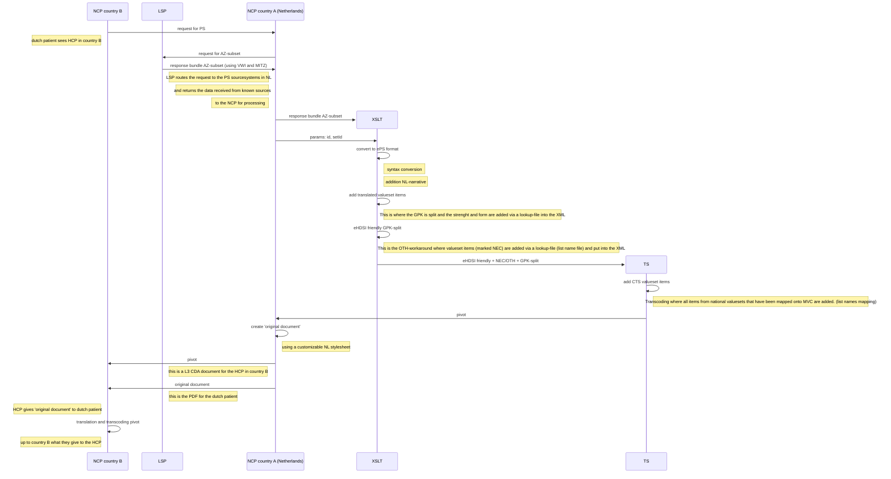

# (draft) with G-standaard GPK-split in PS-A sequence diagram

```mermaid
sequenceDiagram

participant B as NCP country B
participant C as LSP
participant A as NCP country A (Netherlands)

B->>A: request for PS
Note left of B: dutch patient sees HCP in country B
A->>C: request for AZ-subset
C->>A: response bundle AZ-subset (using VWI and MITZ)
Note left of A: LSP routes the request to the PS sourcesystems in NL
Note left of A: and returns the data received from known sources
Note left of A: to the NCP for processing
create participant XSLT
 
    A->>XSLT: response bundle AZ-subset

    A->>XSLT: params: id, setId
  
    XSLT->>XSLT: convert to ePS format
Note right of XSLT: syntax conversion
Note right of XSLT: addition NL-narrative
    XSLT->>XSLT: add translated valueset items
Note right of XSLT: This is where the GPK is split and the strenght and form are added via a lookup-file into the XML
    XSLT->>XSLT : eHDSI friendly GPK-split
Note right of XSLT: This is the OTH-workaround where valueset items (marked NEC) are added via a lookup-file (list name file) and put into the XML
  create participant TS
    XSLT->>TS : eHDSI friendly + NEC/OTH + GPK-split
   TS->>TS: add CTS valueset items
Note right of TS: Transcoding where all items from national valuesets that have been mapped onto MVC are added. (list names mapping)
    TS->>A: pivot
A->>A: create 'original document'
Note right of A: using a customizable NL stylesheet 
A->>B: pivot
Note right of C: this is a L3 CDA document for the HCP in country B
A->>B: original document
Note right of C: this is the PDF for the dutch patient
Note left of B: HCP gives 'original document' to dutch patient
B->>B: translation and transcoding pivot
Note left of B: up to country B what they give to the HCP


```
