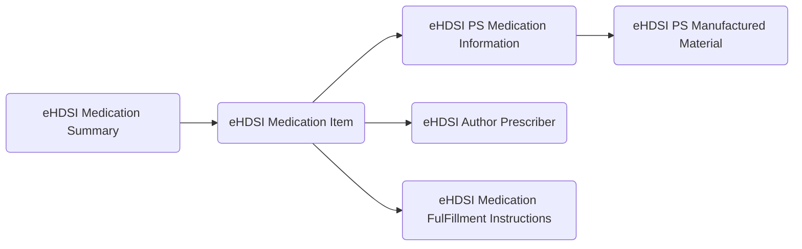

# eHDSI Medication Summary

Huidige en relevante vroegere medicatie: Relevante voorgeschreven geneesmiddelen waarvan de behandelperiode nog niet is verstreken, ongeacht of ze al zijn afgeleverd of niet, of geneesmiddelen die invloed hebben op de huidige gezondheidstoestand of relevant zijn voor een klinische beslissing.

Target: [Template  eHDSI Medication Summary](https://art-decor.ehdsi.eu/publication/epsos-html-20240422T073854/tmp-1.3.6.1.4.1.12559.11.10.1.3.1.2.3-2020-09-07T095657.html) -> [Template eHDSI Medication Item](https://art-decor.ehdsi.eu/publication/epsos-html-20240422T073854/tmp-1.3.6.1.4.1.12559.11.10.1.3.1.3.4-2024-01-25T135932.html)

Source: [MP HL7 Medicatieafspraken Organizer](https://decor.nictiz.nl/pub/medicatieproces/mp-html-20181220T121121/tmp-2.16.840.1.113883.2.4.3.11.60.20.77.10.9265-2018-12-13T000000.html) -> [MP CDA Medicatieafspraak](https://decor.nictiz.nl/pub/medicatieproces/mp-html-20181220T121121/tmp-2.16.840.1.113883.2.4.3.11.60.20.77.10.9235-2018-12-04T143321.html)

# gebruk van CDA Templates in eHDSI Medication Summary

| CDA Template| Omschrijving |
| ----------- | ----------- |
|eHDSI Medication Summary |De sectie "Medicatieoverzicht" moet een beschrijving bevatten van de medicatie van de patiënt als onderdeel van het patiëntoverzicht.|
|eHDSI Medication Item|Dit template maakt gebruik van de template voor het geneesmiddel en instructies voor de apotheker. Medicaties en hun voorschriften behoren wellicht tot de moeilijkste gegevenselementen om te modelleren, vanwege de grote variatie in de manier waarop medicijnen worden voorgeschreven.|
|eHDSI PS Medication Information|Dit beschrijft het gebruik van het geneesmiddel. Alle informatie over het geneesmiddel zelf wordt via de eHDSI PS Manufactured Material-template beschreven.|
|eHDSI PS Manufactured Material|Informatie over het geneesmiddel. Hier zit vooral het werk wat we nog moeten doen voor de G-standaard. het afleiden van de onderdelen die lost moeten worden gemapt op dit template omdat we an het geneesmiddel alleen de PRK-HPK en GPK krijgen uit de KEZO bouwsteen|
|eHDSI Author Prescriber| Hier gaat het over de voorschrijver en dat is een huisarts, specialist etc. Note: Een CDA-document moet minstens één auteur hebben. Auteurs kunnen zowel personen (assignedPerson) als apparaten (assignedAuthoringDevice) zijn. Wanneer er geen zorgverlener (persoon) is, maar de gegevens zijn samengesteld door een apparaat, bijvoorbeeld via samenvoegen door een ander systeem, wordt assignedAuthoringDevice gebruikt. Wanneer de gegevens afkomstig zijn uit verschillende bronnen en bestaande documenten die deel uitmaken van een groter systeem, is de organisatie die verantwoordelijk is voor die gegevensverzameling degene die het patiëntoverzicht (PS) “ondertekent” als verantwoordelijke.|
|eHDSI Medication FulFillment Instructions|Template voor aanvullende instructies aan de apotheker, bijvoorbeeld om aan te geven dat het etiket in het Spaans moet worden opgesteld, enzovoort.|

## eHDSI dataelements

- substanceAdministration statusCode
  - The status of all elements must be either "active" or "completed". Status of "active" indicates a currently valid prescription, status of completed indicates a previously taken medication.
  - wordt afgeleid van einddatum: 
    - (einddatum = leeg of datum > Today = active) en (einddatum = datum < Today = completed) 
    - zie ook <https://github.com/Duometis/ncp-conversie/issues/57>
- medicinal product
  - The name of the substance or product. This should be sufficient for a provider to identify the kind of medication. It may be a trade name or a generic name.
  - Door de GPK-ATC mapping wordt hier altijd de generieke ATC naam gebruikt voor onze medicatie, tenzij er geen GPK code is (b.v. magistrale recepten)
  - EU [Template  eHDSI PS Manufactured Material](https://art-decor.ehdsi.eu/publication/epsos-html-20240422T073854/tmp-1.3.6.1.4.1.12559.11.10.1.3.1.3.32-2024-04-11T135939.html) en dan [Template  eHDSI PS Medication Information](https://art-decor.ehdsi.eu/publication/epsos-html-20240422T073854/tmp-1.3.6.1.4.1.12559.11.10.1.3.1.3.31-2022-01-11T164400.html)
  - NL [Template  MP CDA Medication Contents](https://decor.nictiz.nl/pub/medicatieproces/mp-html-20181220T121121/tmp-2.16.840.1.113883.2.4.3.11.60.20.77.10.9264-2018-12-11T154905.html) en dan [Template  MP CDA Ingredient](https://decor.nictiz.nl/pub/medicatieproces/mp-html-20181220T121121/tmp-2.16.840.1.113883.2.4.3.11.60.20.77.10.9106-2016-06-26T164013.html) voor de active ingredients.

