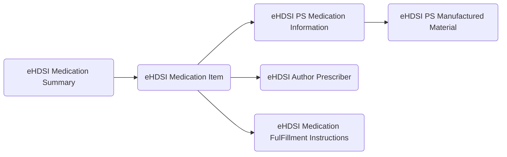

# eHDSI Medication Summary

Target: [Template  eHDSI Medication Summary](https://art-decor.ehdsi.eu/publication/epsos-html-20240422T073854/tmp-1.3.6.1.4.1.12559.11.10.1.3.1.2.3-2020-09-07T095657.html)

Target: 
- [eHDSI Medication Item](https://art-decor.ehdsi.eu/publication/epsos-html-20240422T073854/tmp-1.3.6.1.4.1.12559.11.10.1.3.1.3.4-2024-01-25T135932.html)
- [eHDSI PS Medication Information](https://art-decor.ehdsi.eu/publication/epsos-html-20240422T073854/tmp-1.3.6.1.4.1.12559.11.10.1.3.1.3.31-2022-01-11T164400.html)

- Current and relevant past medicines: Relevant prescribed medicines whose period of time indicated for the treatment has not yet expired whether it has been dispensed or not, or medicines that influence current health status or are relevant to a clinical decision.

Source: [MP HL7 Medicatieafspraken Organizer](https://decor.nictiz.nl/pub/medicatieproces/mp-html-20181220T121121/tmp-2.16.840.1.113883.2.4.3.11.60.20.77.10.9265-2018-12-13T000000.html)

Source MA: [MP CDA Medicatieafspraak](https://decor.nictiz.nl/pub/medicatieproces/mp-html-20181220T121121/tmp-2.16.840.1.113883.2.4.3.11.60.20.77.10.9235-2018-12-04T143321.html)

# Use of Templates in eHDSI Medication Summary

| CDA Template| Description |
| ----------- | ----------- |
|eHDSI Medication Summary |The medication summary section shall contain a description of the patient's medications as part of the patient summary|
|eHDSI Medication Item|This entry content module makes use of the medicine and instruction entry content modules. Medications and their prescriptions are perhaps the most difficult data elements to model due to variations in the ways that medications are prescribed. This profile identifies the following relevant fields of a medication as being important to be able to generate in a medical summary. The table below identifies and describes these fields, and indicates the constraints on whether or not they are required to be sent. The fields are listed in the order that they appear in the CDA XML content.|
|eHDSI PS Medication Information|This entry describes the consumable subject of the medication statement. All the information about the  medication is provided in the included eHDSI PS Manufactured Material template.|
|eHDSI PS Manufactured Material|All the information about the  medication|
|eHDSI Author Prescriber|A CDA document shall have at least one author. Authors could be either human (assignedPerson) either devices (assignedAuthoringDevice). When there is no HP but we have the method of assembly of data by a device, such as the “spider” method, we have assignedAuthoringDevice. When the data is collected from different sources & pre-existing documents that are part of a bigger system. In that case the organization responsible of that collection “signed” the PS as responsible.|
|eHDSI Medication FulFillment Instructions|Any medication may be the subject of further instructions to the pharmacist, for example to indicate that it should be labeled in Spanish, et cetera. This structure is included in the target substance administration or supply act using the element defined in the CDA Schema. The figure below is an example of recording an instruction for an , and is used as context for the sections to follow.|

