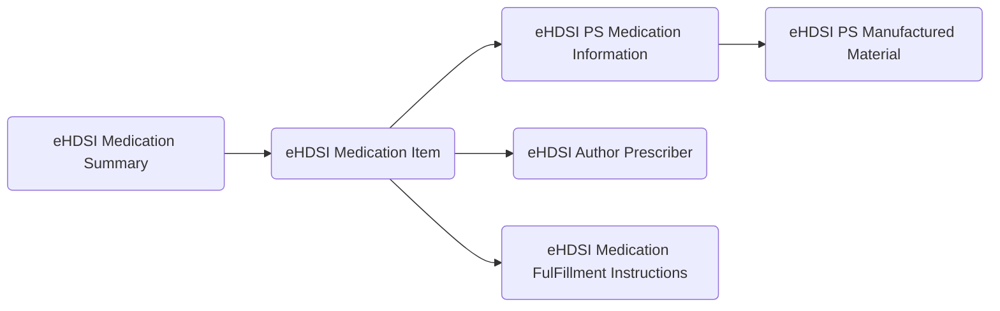
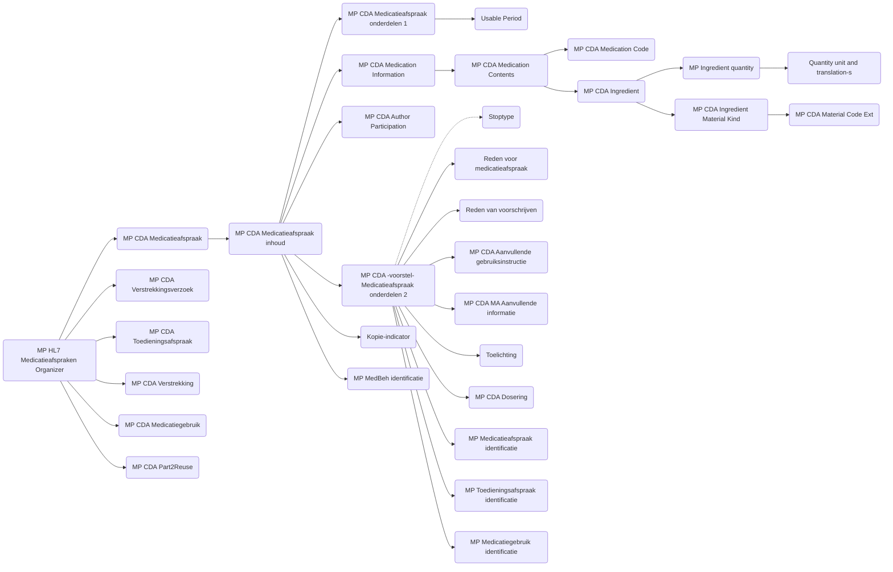

# eHDSI Medication Summary

Huidige en relevante vroegere medicatie: Relevante voorgeschreven geneesmiddelen waarvan de behandelperiode nog niet is verstreken, ongeacht of ze al zijn afgeleverd of niet, of geneesmiddelen die invloed hebben op de huidige gezondheidstoestand of relevant zijn voor een klinische beslissing.

Target: [Template  eHDSI Medication Summary](https://art-decor.ehdsi.eu/publication/epsos-html-20240422T073854/tmp-1.3.6.1.4.1.12559.11.10.1.3.1.2.3-2020-09-07T095657.html) -> [Template eHDSI Medication Item](https://art-decor.ehdsi.eu/publication/epsos-html-20240422T073854/tmp-1.3.6.1.4.1.12559.11.10.1.3.1.3.4-2024-01-25T135932.html)

Source: [MP HL7 Medicatieafspraken Organizer](https://decor.nictiz.nl/pub/medicatieproces/mp-html-20181220T121121/tmp-2.16.840.1.113883.2.4.3.11.60.20.77.10.9265-2018-12-13T000000.html) -> [MP CDA Medicatieafspraak](https://decor.nictiz.nl/pub/medicatieproces/mp-html-20181220T121121/tmp-2.16.840.1.113883.2.4.3.11.60.20.77.10.9235-2018-12-04T143321.html)

# gebruik van CDA Templates in eHDSI Medication Summary

### eHDSI Medication Summary – Templates met beschrijving en Nederlandse vertaling

| # | Template-naam | Template-ID (OID) | URL | Beschrijving (EN) | Vertaling (NL) |
|---|----------------|------------------|-----|-------------------|----------------|
| 1 | **eHDSI Medication Summary** | 1.3.6.1.4.1.12559.11.10.1.3.1.2.3 | [Link](https://art-decor.ehdsi.eu/publication/epsos-html-20240422T073854/tmp-1.3.6.1.4.1.12559.11.10.1.3.1.2.3-2020-09-07T095657.html) | The medication summary section shall contain a description of the patient’s medications as part of the patient summary. | De sectie ‘Medicatieoverzicht’ bevat een beschrijving van de medicatie van de patiënt als onderdeel van de samenvatting van de patiënt. |
| 2 | **eHDSI Medication Item** | 1.3.6.1.4.1.12559.11.10.1.3.1.3.4 | [Link](https://art-decor.ehdsi.eu/publication/epsos-html-20240422T073854/tmp-1.3.6.1.4.1.12559.11.10.1.3.1.3.4-2024-01-25T135932.html) | This entry content module makes use of the medicine and instruction entry content modules. Medications and their prescriptions are perhaps the most difficult data elements to model. | Dit inhoudssjabloon maakt gebruik van de modules voor geneesmiddel- en instructie-invoer. Medicatie en voorschriften behoren tot de meest complexe gegevens om te modelleren. |
| 3 | **eHDSI PS Medication Information** | 1.3.6.1.4.1.12559.11.10.1.3.1.3.31 | [Link](https://art-decor.ehdsi.eu/publication/epsos-html-20240422T073854/tmp-1.3.6.1.4.1.12559.11.10.1.3.1.3.31-2022-01-11T164400.html) | This entry describes the consumable subject of the medication statement. All the information about the medication is provided in the included eHDSI PS Manufactured Material template. | Deze invoer beschrijft het verbruikbare middel dat het onderwerp vormt van de medicatieverklaring. Alle informatie over het geneesmiddel wordt geleverd via het bijgevoegde sjabloon ‘eHDSI PS Manufactured Material’. |
| 4 | **eHDSI PS Manufactured Material** | 1.3.6.1.4.1.12559.11.10.1.3.1.3.32 | [Link](https://art-decor.ehdsi.eu/publication/epsos-html-20240422T073854/tmp-1.3.6.1.4.1.12559.11.10.1.3.1.3.32-2024-04-11T135939.html) | Defines the manufactured material that represents the physical product of the medication, including identifiers, form, and strength. It is used to specify the actual medicinal product administered or prescribed. | Definieert het geproduceerde geneesmiddel dat het fysieke product van de medicatie vertegenwoordigt, inclusief identificatie, vorm en sterkte. Wordt gebruikt om het daadwerkelijk voorgeschreven of toegediende geneesmiddel te specificeren. |
| 5 | **eHDSI Author Prescriber** | 2.16.840.1.113883.3.1937.777.11.10.103 | [Link](https://art-decor.ehdsi.eu/publication/epsos-html-20240422T073854/tmp-2.16.840.1.113883.3.1937.777.11.10.103-2020-09-07T095701.html) | A CDA document shall have at least one author. The author element represents the creator of the clinical document or the actor entering information based on their own knowledge or skills. | Een CDA-document moet ten minste één auteur bevatten. Het auteurelement vertegenwoordigt de opsteller van het klinisch document of de actor die informatie invoert op basis van eigen kennis of deskundigheid. |
| 6 | **eHDSI Medication FulFillment Instructions** | 1.3.6.1.4.1.12559.11.10.1.3.1.3.13 | [Link](https://art-decor.ehdsi.eu/publication/epsos-html-20240422T073854/tmp-1.3.6.1.4.1.12559.11.10.1.3.1.3.13-2020-09-03T123053.html) | Specifies the instructions for fulfilling or dispensing the medication, including number of repeats, supply quantity, and timing constraints for the pharmacist. | Geeft de instructies voor het afleveren of verstrekken van de medicatie, inclusief het aantal herhalingen, de hoeveelheid en de tijdsbeperkingen voor de apotheker. |

# gebruik van CDA Templates in Acute Zorg KEZO bouwstenen

| CDA Template| Omschrijving | opmerking |
| ----------- | ----------- |----------- |
|MP HL7 Medicatieafspraken Organizer|Lijst van medicatieafspraken||
|MP CDA Medicatieafspraak|	Medicatieafspraak met eventueel op-/afbouw schema|koppelingen met Medicatieafspraak, gebruiksinstructue, relaties ketenzorg|
|MP CDA Medicatieafspraak inhoud|Medicatieafspraak met eventueel op-/afbouw schema| koppelingen met voorschrijver, afgesproken geneesmiddel|
|MP CDA Medicatieafspraak onderdelen 1|MP CDA Medicatieafspraak onderdelen, deel 1|koppelingen met identificatie, geannuleerd indicator, omschrijving, gebruiksperiode, toedieningsweg|
|Usable Period|Gebruiksperiode||
|MP CDA Medication Information|MP CDA Medication Information| product (afgesproken geneesmiddel)|
|MP CDA Medication Contents|MP CDA Medication Information inhoud||
|MP CDA Medication Code|Medicatie codering voor medicatieproces, CDA versie||
|MP CDA Ingredient|Ingrediënt van medicatie (CDA extensie)||
|MP Ingredient quantity|De relatieve hoeveelheid van dit ingrediënt in de aangeduide medicatie||
|Quantity unit and translation|Template: Quantity unit and Translation(s)||
|MP CDA Ingredient Material Kind|Materiaalsoort (CDA extensie) ||
|MP CDA Material Code Ext|Material Code Ext (CDA)||
|MP CDA Author Participation|CDA Author Participation voor medicatieproces||
|MP CDA voorstel Medicatieafspraak onderdelen 2|Medicatieafspraak onderdelen voor de gewone medicatieafspraak én de Voorstel medicatieafspraak en de medicatieafspraak in het voorstel verstrekkingsverzoek, deel 2| hier zitten nog 10 templates onder, maar die hebben we (denk ik) nog niet nodig|
|active Kopie -indicator|	Kopie-indicator - bij bouwstenen in medicatieproces||
|active MP MedBeh identificatie|Identificatie van de medicamenteuze behandeling||

## eHDSI dataelements (as-is 18 oktober 2025)

- substanceAdministration statusCode
  - The status of all elements must be either "active" or "completed". Status of "active" indicates a currently valid prescription, status of completed indicates a previously taken medication.
  - wordt afgeleid van einddatum: 
    - (einddatum = leeg of datum > Today = active) en (einddatum = datum < Today = completed) 
    - zie ook <https://github.com/Duometis/ncp-conversie/issues/57>
- medicinal product
  - The name of the substance or product. This should be sufficient for a provider to identify the kind of medication. It may be a trade name or a generic name.
  - Door de GPK-ATC mapping wordt hier altijd de generieke ATC naam gebruikt voor onze medicatie, tenzij er geen GPK code is (b.v. magistrale recepten)
  - EU [Template  eHDSI PS Manufactured Material](https://art-decor.ehdsi.eu/publication/epsos-html-20240422T073854/tmp-1.3.6.1.4.1.12559.11.10.1.3.1.3.32-2024-04-11T135939.html) en dan [Template  eHDSI PS Medication Information](https://art-decor.ehdsi.eu/publication/epsos-html-20240422T073854/tmp-1.3.6.1.4.1.12559.11.10.1.3.1.3.31-2022-01-11T164400.html)
  - NL [Template  MP CDA Medication Contents](https://decor.nictiz.nl/pub/medicatieproces/mp-html-20181220T121121/tmp-2.16.840.1.113883.2.4.3.11.60.20.77.10.9264-2018-12-11T154905.html) en dan [Template  MP CDA Ingredient](https://decor.nictiz.nl/pub/medicatieproces/mp-html-20181220T121121/tmp-2.16.840.1.113883.2.4.3.11.60.20.77.10.9106-2016-06-26T164013.html) voor de active ingredients.

## Syntax mapping (as-is 18 oktober 2025)

| eHDSI | source | target | remarks |
| ----------- | ----------- |-----------  |----------- |
| substanceAdministration | 
| @moodCode | | obv. einddatum, INT als toekomst, EVN als beëindigd
| .code | | fixed 'DRUG'
| .statusCode | | obv. einddatum, zie https://github.com/Duometis/ncp-conversie/issues/57 
| .effectiveTime als IVL_TS | COPY als IVL_TS in input | anders 'NI' | De eerste effectiveTime in eHDSI is duur medicatieafspraak
| .routeCode | COPY |
| .doseQuantity | COPY bij 1, weglaten bij meerdere (niet betrouwbaar)
| .rateQuantity | als doseQuantity
| .consumable | | ph:asSpecializedKind classCode="GRIC" voor ATC ph:asSpecializedKind classCode="GEN" voor HPK, PRK, GPK
| .ingredient ||weglaten, is niet gecodeerd naar wel/niet active in acute zorg

## Toelichting eHDSI CDA display tool (as-is 18 oktober 2025)

De eerste kolom bevat de generieke productnaam en dat is de ATC, zie: eHDSI PS Medication Information, eerste "pharm:asSpecializedKind", daar staat:

"This module is used for representing the classification of the Substance according to the WHO Anatomical Therapeutic Chemical (ATC) Classification System.

The classCode of "GRIC" identifies this structure as the representation of a generic equivalent of the medication described in the current Medicine entry."

Active ingredient staat iets verder onder "pharm:ingredient" en daar staat:

"One or more active ingredients may be represented with this structure. The classCode of "ACTI" indicates that this is an active ingredient. The element contains the coded representation of the ingredient and the element may be used for the plain text representation."

Die kunnen wij niet vullen omdat onze MP bouwstenen geen onderscheid maken tussen actieve en andere ingredienten.

Zo werkt de CDA display tool van de EU ook. Die laat - als aanwezig - de ATC code in de eerste kolom zien en als die niet aanwezig is de hele naam.

## Toelichting dosering (as-is 18 oktober 2025)

De Nederlandse dosering kent het volgende toedienschema bij de doseerschema's:

- Eenvoudig doseerschema met alleen één frequentie.
- Eenvoudig doseerschema met alleen één interval.
- Eenvoudig doseerschema met één vast tijdstip.
- Doseerschema met toedieningsduur.
- Doseerschema met meer dan één vast tijdstip.
- Cyclisch doseerschema.
- Eenmalig gebruik of aantal keren gebruik zonder tijd.
- Doseerschema één keer per week op één weekdag.
- Complexer doseerschema met weekdag(en).
- Nacht
- Ochtend
- Middag
- Avond
- Complexer doseerschema met meer dan één dagdeel.
- Veelal met eigen CDA templates en vaak NL datatypes. <mark>LM: Welke templates zijn er allemaal en hoe vaak worden ze gebruikt? Zijn er templates bij die we vervolgens NIET proberen te mappen op de eHDSI Medication Item template en vervolgens WEL meenemen in de narrative? Dan wordt het wel zichtbaar (in het nederlands) voor de patient in de PDF.</mark>

De eHDSI Medication Item heeft:

- **IVL_TS**: The first element encodes the start and stop time of the medication regimen or the length of the medication regimen. This is an interval of time (xsi:type='IVL_TS'), and must be specified as shown. This is an additional constraint placed upon CDA Release 2.0 by this profile, and simplifies the exchange of start/stop/length and frequency information between EMR systems. If no information is available for the dosage period, a nullFlavor attribute has to be provided with the value 'UNK'.
  - **Case 1**: specified interval
  - **Case 2**: 'floating' period
- **TS**: This required element describes the frequency of intakes. If not known it shall be valued with the nullflavor "UNK". TS represents a single point in time, and is the simplest of all to represent.
- **PIVL_TS**: This is the most commonly used, representing a periodic interval of time.
- **EIVL_TS**: Represents an event-based time interval.
- **SXPR_TS**: Represents a parenthetical set of time expressions.

Note: De gegevenstypen van de Nederlandse doseringen moeten worden vertaald naar de eHDSI-dosering wanneer we deze willen converteren. Dit is een complex vraagstuk dat grondige kennis van medicatieprocessen (MP) vereist, en het is de vraag of deze conversie überhaupt mogelijk is <mark>LM: Kunnen we er achter komen voor welke doseerschema's en templates dit wel lukt?</mark>

Daaronder zitten twee een doseerschema's:

- DoseQuantity: relatief eenvoudig maar met low/high en center die op de andere eHDSI doseringen aangepast moeten worden
- Toedieningssnelheid: deze lijkt wel te mappen op de EU waarden
Deze zijn beter mapbaar maar hebben weinig betekenis zonder toedienschema.

Besloten is dosering niet te doen op dit moment <mark>LM: dit besluit is in het voorjaar van 2025 genomen omdat er geen mensen vanuit het MP team beschikbaar waren om het uit te zoeken</mark>; wanneer in pivot alleen active ingredient (ATC, b..v "IBUPROFEN") uitgewisseld wordt in vertaalde vorm is dosering in Nederlandse vorm zinloos: dat is b.v. 3x daags 2 weken, maar zonder sterkte (400 mg of zo) heeft dat geen informatieve waarde. Sterkte en vorm van medicatie zouden uit G-standaard gehaald moeten worden om zinvolle doseringen uit te kunnen wisselen.<mark>LM: dit is wat we met de PRK-HPK-GPK split wel gaan doen. Afhankelijk of we alle varianten van doseerschema's nodig hebben en kunnen mappen op de eHDSI medication item </mark>

Dosering kan wel in NL narrative en/of Original document. <mark>LM: de narrative werkt nog niet op alles. Dit moet ook nog worden bekeken. </mark>

## Acute zorg (as-is 18 oktober 2025)

In [MP CDA Medicatieafspraak inhoud](https://decor.nictiz.nl/pub/medicatieproces/mp-html-20181220T121121/tmp-2.16.840.1.113883.2.4.3.11.60.20.77.10.9233-2018-12-04T130547.html) staan de volgende items:

Deze kunnen allen genegeerd worden:

- Stoptype
- Reden medicatieafspraak
- Reden van voorschrijven
- Aanvullende Instructie.
- Lichaamslengte
- Lichaamsgewicht
- Aanvullende informatie voor medicatieafspraak
- Toelichting
- Relatie naar dosering	(MPCdotsud2)
- Relatie naar afspraak of gebruik	(MPCdotsud2)

## Terminology Mapping (as-is 18 oktober 2025)

| eHDSI | source | target | remarks |
| ----------- | ----------- |-----------  |----------- |
||als [MP HL7 Medicatieafspraken Organizer] geen [hl7:component] heeft van [ MP CDA Medicatieafspraak] of [MP CDA Medicatieafspraak andermans]|[eHDSIAbsentOrUnknownMedication 2020‑04‑21](https://art-decor.ehdsi.eu/publication/epsos-html-20240422T073854/tmp-1.3.6.1.4.1.12559.11.10.1.3.1.2.3-2020-09-07T095657.html)|One of the concepts from the target valueset shall be used in the code element to record that a patient is either not on medications, or that medications are not known.|
|medicinal product| [Template MP CDA Medication Code](https://decor.nictiz.nl/pub/medicatieproces/mp-html-20181220T121121/tmp-2.16.840.1.113883.2.4.3.11.60.20.77.10.9253-2018-12-06T133041.html0)|[Template  eHDSI PS Manufactured Material](https://art-decor.ehdsi.eu/publication/epsos-html-20240422T073854/tmp-1.3.6.1.4.1.12559.11.10.1.3.1.3.32-2024-04-11T135939.html)| "The name of the substance or product. This should be sufficient for a provider to identify the kind of medication. It may be a trade name or a generic name. This information is required in all medication entries. If the name of the medication is unknown, the type, purpose or other description may be supplied. The name should not include packaging, strength or dosing information."|
|active ingredients |uit mapping GPK halen?||<mark>toekomst</mark>|
|strength |uit mapping GPK halen voor ieder ingredient?||<mark>toekomst</mark>|
|eHDSIDoseForm |||mapping FarmaceutischeVormCodelijst op DoseForm (CTS en NEC mapping)|
|units per intake |Doseerinstructie||<mark>toekomst</mark>|
|frequency of intake |Doseerinstructie||<mark>toekomst</mark>|
|eHDSIRouteofAdministration |[Template  MP CDA Medicatieafspraak](https://decor.nictiz.nl/pub/medicatieproces/mp-html-20181220T121121/tmp-2.16.840.1.113883.2.4.3.11.60.20.77.10.9235-2018-12-04T143321.html) cda:routeCode, mp-dataelement900-23242 final Toedieningsweg 9|Route of administration [eHDSIRouteofAdministration](https://art-decor.ehdsi.eu/publication/epsos-html-20240422T073854/voc-1.3.6.1.4.1.12559.11.10.1.3.1.42.12-DYNAMIC.html)|Toedieningsweg, G-Standaard tabel voor toedieningswegen: subtabel 0007, NL Value Set ID 2.16.840.1.113883.2.4.3.11.60.40.2.9.5.6. Combinatie van NEC en CTS items van - NL VoorschriftToedieningswegCodelijst naar EU eHDSIRouteofAdministration|
|duration of treatment |Gebruiksperiode:ingangsdatum + einddatum|||
|medication reason |staat niet in Medicatieafspraak|||
