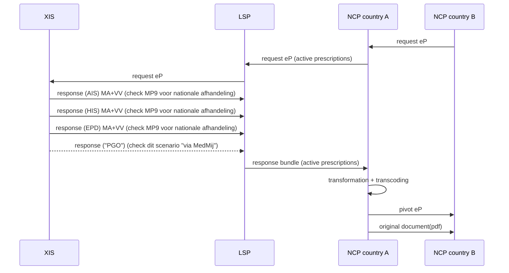
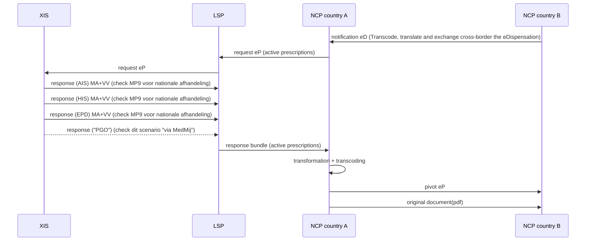

# eP sequence diagram

```mermaid
sequenceDiagram
    participant XIS
    participant LSP
    participant A as NCP country A
    participant B as NCP country B
    B->>A: request eP
    A->>LSP: request eP (active prescriptions)
    LSP->>XIS: request eP 
  XIS->>LSP: response (AIS) MA+VV (check MP9 voor nationale afhandeling)
  XIS->>LSP: response (HIS) MA+VV (check MP9 voor nationale afhandeling)
  XIS->>LSP: response (EPD) MA+VV (check MP9 voor nationale afhandeling)
  XIS-->>LSP: response ("PGO") (check dit scenario "via MedMij")
  LSP->>A: response bundle (active prescriptions)
    A->>A: transformation + transcoding
    A->>B: pivot eP
    A->>B: original document(pdf)
```
# eD sequence diagram

```mermaid
sequenceDiagram
    participant XIS
    participant LSP
    participant A as NCP country A
    participant B as NCP country B
    B->>A: notification eD (Transcode, translate and exchange cross-border the eDispensation)
    A->>LSP: request eP (active prescriptions)
    LSP->>XIS: request eP 
  XIS->>LSP: response (AIS) MA+VV (check MP9 voor nationale afhandeling)
  XIS->>LSP: response (HIS) MA+VV (check MP9 voor nationale afhandeling)
  XIS->>LSP: response (EPD) MA+VV (check MP9 voor nationale afhandeling)
  XIS-->>LSP: response ("PGO") (check dit scenario "via MedMij")
  LSP->>A: response bundle (active prescriptions)
    A->>A: transformation + transcoding
    A->>B: pivot eP
    A->>B: original document(pdf)
```
