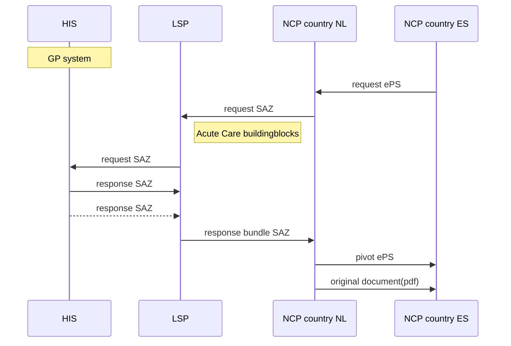
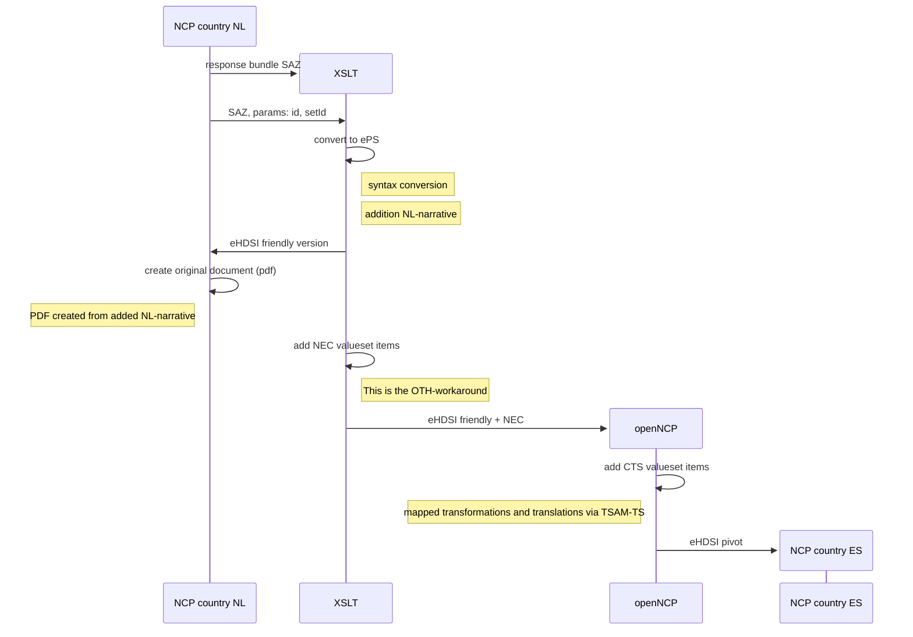

# PIEZO-A Netherlands sequence diagram

```mermaid
sequenceDiagram
Note over HIS: GP system
    participant HIS
    participant LSP

  
    participant A as NCP country NL
    participant B as NCP country ES
    B->>A: request ePS
    A->>LSP: request SAZ
Note right of LSP: Acute Care buildingblocks
   
    LSP->>HIS: request SAZ
    HIS->>LSP: response SAZ
    HIS-->>LSP: response SAZ
     LSP->>A: response bundle SAZ

    A->>B: pivot ePS
    A->>B: original document(pdf)
    
```
# XSLT and openNCP transformations

```mermaid
sequenceDiagram

  participant A as NCP country NL
 
create participant XSLT

 
    A->>XSLT: response bundle SAZ

    A->>XSLT: SAZ, params: id, setId
  
    XSLT->>XSLT: convert to ePS
Note right of XSLT: syntax conversion
Note right of XSLT: addition NL-narrative

    XSLT->>A: eHDSI friendly version
    A->>A: create original document (pdf)
Note left of A: PDF created from added NL-narrative
    XSLT->>XSLT: add NEC valueset items
Note right of XSLT: This is the OTH-workaround
  create participant openNCP
    XSLT->>openNCP: eHDSI friendly + NEC 
   openNCP->>openNCP: add CTS valueset items
Note left of openNCP: mapped transformations and translations via TSAM-TS
create participant NCP country ES
    openNCP->> NCP country ES: eHDSI pivot

```
