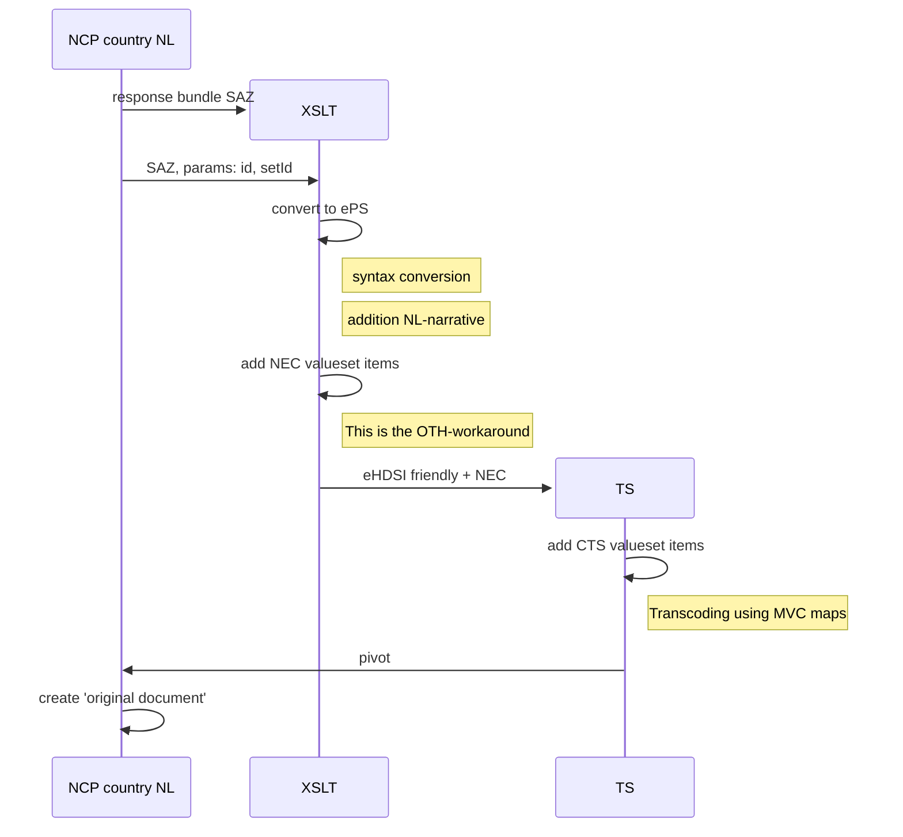

# XSLT and openNCP transformations

```mermaid
sequenceDiagram

participant A as NCP country NL
 
create participant XSLT

 
    A->>XSLT: response bundle SAZ

    A->>XSLT: SAZ, params: id, setId
  
    XSLT->>XSLT: convert to ePS
Note right of XSLT: syntax conversion
Note right of XSLT: addition NL-narrative
    XSLT->>XSLT: add NEC valueset items
Note right of XSLT: This is the OTH-workaround
  create participant TS
    XSLT->>TS : eHDSI friendly + NEC 
   TS->>TS: add CTS valueset items
Note right of TS: Transcoding using MVC maps
    TS->>A: pivot

A->>A: create 'original document'


```
