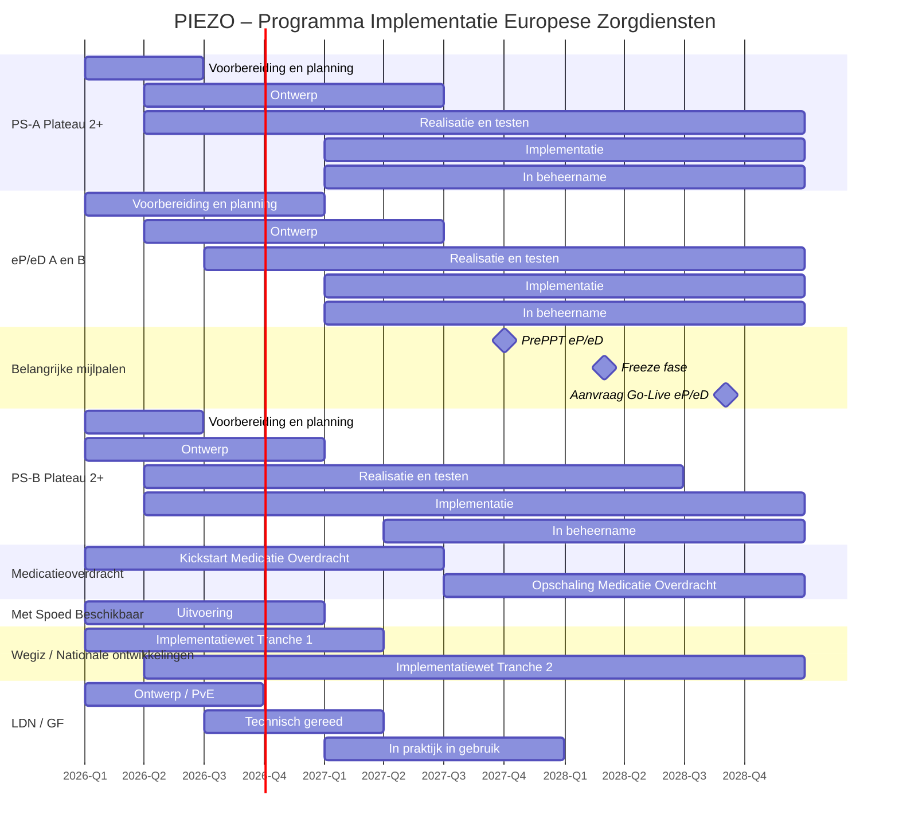

# PIEZO – Programma Implementatie Europese Zorgdiensten

## Overzicht

Planning gebaseerd op de aangeleverde Gantt-chart.

---

# Mijlpalen

| Mijlpaal | Periode |
|---|---|
| PrePPT eP/eD | Q4 2027 |
| Freeze fase | Q1–Q2 2028 |
| Aanvraag Go-Live eP/eD | Q3 2028 |

## Freeze fase omvat

- Bevindingen verwerken
- Kleine aanpassingen
- Ketentesten
- Initial compliance check

---

# Planning

## PS-A Plateau 2 en verder

| Activiteit | Start | Eind |
|---|---|---|
| Voorbereiding en planning | Q1 2026 | Q2 2026 |
| Ontwerp | Q2 2026 | Q2 2027 |
| Realisatie en testen | Q2 2026 | Q4 2028 |
| Implementatie | Q1 2027 | Q4 2028 |
| In beheername | Q1 2027 | Q4 2028 |

---

## eP / eD A en B

| Activiteit | Start | Eind |
|---|---|---|
| Voorbereiding en planning | Q1 2026 | Q4 2026 |
| Ontwerp | Q2 2026 | Q2 2027 |
| Realisatie en testen | Q3 2026 | Q4 2028 |
| Implementatie | Q1 2027 | Q4 2028 |
| In beheername | Q1 2027 | Q4 2028 |

---

## PS-B Plateau 2 en verder

| Activiteit | Start | Eind |
|---|---|---|
| Voorbereiding en planning | Q1 2026 | Q2 2026 |
| Ontwerp | Q1 2026 | Q4 2026 |
| Realisatie en testen | Q2 2026 | Q2 2028 |
| Implementatie | Q2 2026 | Q4 2028 |
| In beheername | Q2 2027 | Q4 2028 |

---

## Programma Medicatieoverdracht

| Activiteit | Start | Eind |
|---|---|---|
| Kickstart Medicatie Overdracht | Q1 2026 | Q2 2027 |
| Opschaling Medicatie Overdracht | Q3 2027 | Q4 2028 |

---

## Programma Met Spoed Beschikbaar

| Activiteit | Start | Eind |
|---|---|---|
| Uitvoering Met Spoed Beschikbaar | Q1 2026 | Q4 2026 |

---

## Andere nationale ontwikkelingen (Wegiz etc.)

| Activiteit | Start | Eind |
|---|---|---|
| Implementatiewet Tranche 1 | Q1 2026 | Q1 2027 |
| Implementatiewet Tranche 2 | Q2 2026 | Q4 2028 |

---

## LDN / GF

| Activiteit | Start | Eind |
|---|---|---|
| Ontwerp / PvE | Q1 2026 | Q3 2026 |
| Technisch gereed | Q3 2026 | Q1 2027 |
| In praktijk in gebruik | Q1 2027 | Q4 2027 |

---

# Gantt Chart

