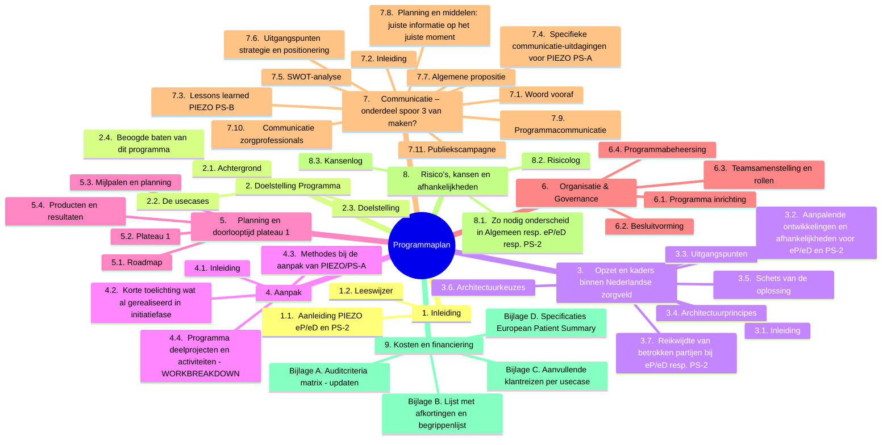

```mermaid
mindmap
  root((Programmaplan))
    1. Inleiding
      1.1.	Aanleiding PIEZO eP/eD en PS-2
      1.2.	Leeswijzer
    2.	Doelstelling Programma
      2.1.	Achtergrond
      2.2.	De usecases
      2.3.	Doelstelling
      2.4.	Beoogde baten van dit programma
    3.	Opzet en kaders binnen Nederlandse zorgveld
      3.1.	Inleiding
      3.2.	Aanpalende ontwikkelingen en afhankelijkheden voor eP/eD en PS-2
      3.3.	Uitgangspunten
      3.4.	Architectuurprincipes
      3.5.	Schets van de oplossing
      3.6.	Architectuurkeuzes
      3.7.	Reikwijdte van betrokken partijen bij eP/eD resp. PS-2
    4.	Aanpak
      4.1.	Inleiding
      4.2.	Korte toelichting wat al gerealiseerd in initiatiefase
      4.3.	Methodes bij de aanpak van PIEZO/PS-A
      4.4.	Programma deelprojecten en activiteiten - WORKBREAKDOWN
    5.	Planning en doorlooptijd plateau 1
      5.1.	Roadmap
      5.2.	Plateau 1
      5.3.	Mijlpalen en planning
      5.4.	Producten en resultaten
    6.	Organisatie & Governance
      6.1.	Programma inrichting
      6.2.	Besluitvorming
      6.3.	Teamsamenstelling en rollen
      6.4.	Programmabeheersing
    7.	Communicatie – onderdeel spoor 3 van maken?
      7.1.	Woord vooraf
      7.2.	Inleiding
      7.3.	Lessons learned PIEZO PS-B
      7.4.	Specifieke communicatie-uitdagingen voor PIEZO PS-A
      7.5.	SWOT-analyse
      7.6.	Uitgangspunten strategie en positionering
      7.7.	Algemene propositie
      7.8.	Planning en middelen: juiste informatie op het juiste moment
      7.9.	Programmacommunicatie
      7.10.	Communicatie zorgprofessionals
      7.11.	Publiekscampagne
    8.	Risico’s, kansen en afhankelijkheden
      8.1.	Zo nodig onderscheid in Algemeen resp. eP/eD resp. PS-2
      8.2.	Risicolog
      8.3.	Kansenlog
    9.	Kosten en financiering
      Bijlage A. Auditcriteria matrix - updaten
      Bijlage B. Lijst met afkortingen en begrippenlijst
      Bijlage C. Aanvullende klantreizen per usecase
      Bijlage D. Specificaties European Patient Summary
```
