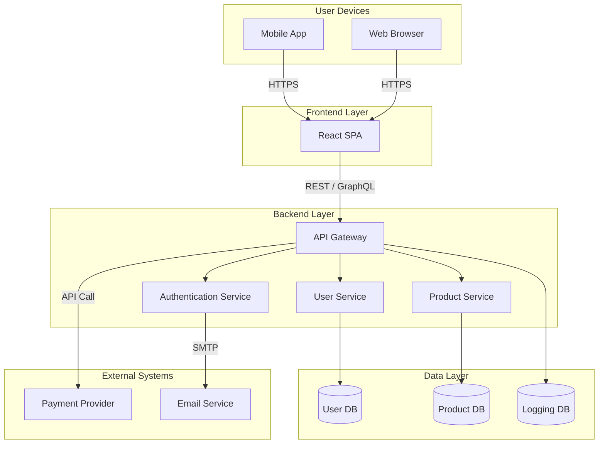

```mermaid
graph TD
    %% System context diagram for a web app
    subgraph User_Devices[User Devices]
        A1[Mobile App]
        A2[Web Browser]
    end

    subgraph Frontend[Frontend Layer]
        B1[React SPA]
    end

    subgraph Backend[Backend Layer]
        C1[API Gateway]
        C2[Authentication Service]
        C3[User Service]
        C4[Product Service]
    end

    subgraph Data[Data Layer]
        D1[(User DB)]
        D2[(Product DB)]
        D3[(Logging DB)]
    end

    subgraph External[External Systems]
        E1[Payment Provider]
        E2[Email Service]
    end

    %% Connections
    A1 -->|HTTPS| B1
    A2 -->|HTTPS| B1
    B1 -->|REST / GraphQL| C1
    C1 --> C2
    C1 --> C3
    C1 --> C4
    C3 --> D1
    C4 --> D2
    C1 --> D3
    C1 -->|API Call| E1
    C2 -->|SMTP| E2

```
