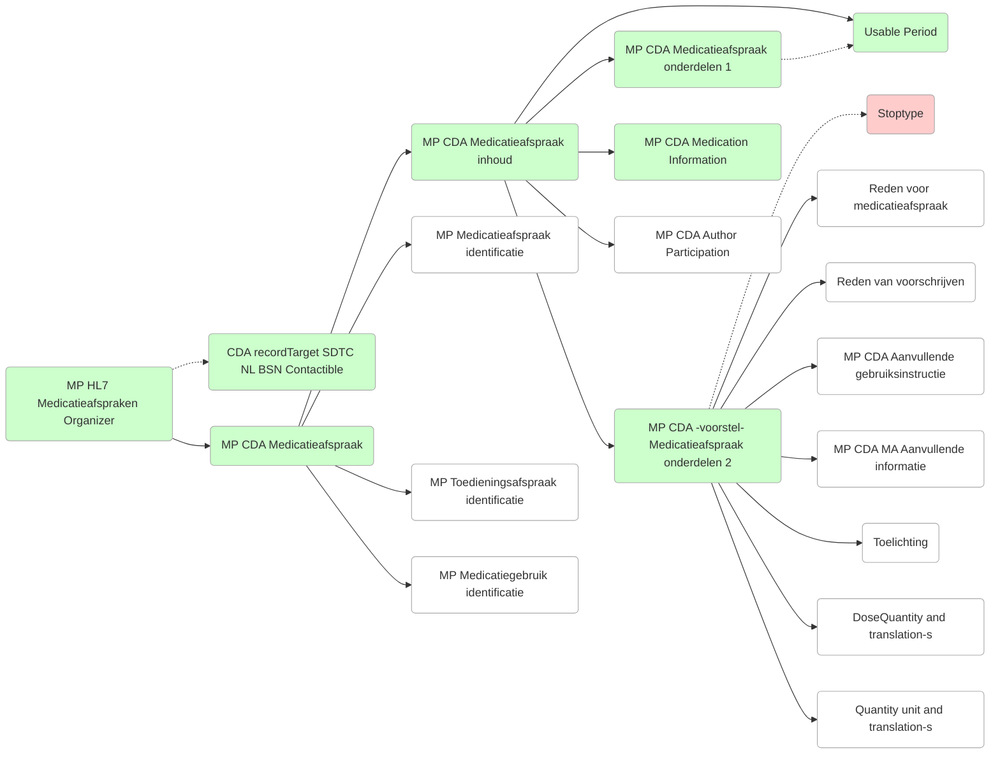

| #  | Template-naam                                    | Template-ID (OID)                           | URL                                                                                                                                                         |
| -- | ------------------------------------------------ | ------------------------------------------- | ----------------------------------------------------------------------------------------------------------------------------------------------------------- |
| 1  | MP HL7 Medicatieafspraken Organizer              | 2.16.840.1.113883.2.4.3.11.60.20.77.10.9265 | [Template 9265](https://decor.nictiz.nl/pub/medicatieproces/mp-html-20181220T121121/tmp-2.16.840.1.113883.2.4.3.11.60.20.77.10.9265-2018-12-13T000000.html) |
| 2  | MP CDA Medicatieafspraak                         | 2.16.840.1.113883.2.4.3.11.60.20.77.10.9235 | [Template 9235](https://decor.nictiz.nl/pub/medicatieproces/mp-html-20181220T121121/tmp-2.16.840.1.113883.2.4.3.11.60.20.77.10.9235-2018-12-04T143321.html) |
| 3  | MP CDA Medicatieafspraak inhoud                  | 2.16.840.1.113883.2.4.3.11.60.20.77.10.9233 | [Template 9233](https://decor.nictiz.nl/pub/medicatieproces/mp-html-20181220T121121/tmp-2.16.840.1.113883.2.4.3.11.60.20.77.10.9233-2018-12-04T130547.html) |
| 4  | MP CDA Medicatieafspraak onderdelen-1            | 2.16.840.1.113883.2.4.3.11.60.20.77.10.9184 | [Template 9184](https://decor.nictiz.nl/pub/medicatieproces/mp-html-20181220T121121/tmp-2.16.840.1.113883.2.4.3.11.60.20.77.10.9184-2017-08-18T092503.html) |
| 5  | Usable Period                                    | 2.16.840.1.113883.2.4.3.11.60.20.77.10.9019 | [Template 9019](https://decor.nictiz.nl/pub/medicatieproces/mp-html-20181220T121121/tmp-2.16.840.1.113883.2.4.3.11.60.20.77.10.9019-2016-07-01T155004.html) |
| 6  | MP CDA Medication Information                    | 2.16.840.1.113883.2.4.3.11.60.20.77.10.9254 | [Template 9254](https://decor.nictiz.nl/pub/medicatieproces/mp-html-20181220T121121/tmp-2.16.840.1.113883.2.4.3.11.60.20.77.10.9254-2018-12-06T143451.html) |
| 7  | MP CDA Medication Contents                       | 2.16.840.1.113883.2.4.3.11.60.20.77.10.9264 | [Template 9264](https://decor.nictiz.nl/pub/medicatieproces/mp-html-20181220T121121/tmp-2.16.840.1.113883.2.4.3.11.60.20.77.10.9264-2018-12-11T154905.html) |
| 8  | MP CDA Medication Code                           | 2.16.840.1.113883.2.4.3.11.60.20.77.10.9253 | [Template 9253](https://decor.nictiz.nl/pub/medicatieproces/mp-html-20181220T121121/tmp-2.16.840.1.113883.2.4.3.11.60.20.77.10.9253-2018-12-06T133041.html) |
| 9  | MP CDA Ingredient                                | 2.16.840.1.113883.2.4.3.11.60.20.77.10.9106 | [Template 9106](https://decor.nictiz.nl/pub/medicatieproces/mp-html-20181220T121121/tmp-2.16.840.1.113883.2.4.3.11.60.20.77.10.9106-2016-06-26T164013.html) |
| 10 | MP Ingredient quantity                           | 2.16.840.1.113883.2.4.3.11.60.20.77.10.9107 | —                                                                                                                                                           |
| 11 | MP CDA Ingredient Material Kind                  | 2.16.840.1.113883.2.4.3.11.60.20.77.10.9368 | [Template 9368](https://decor.nictiz.nl/pub/medicatieproces/mp-html-20181220T121121/tmp-2.16.840.1.113883.2.4.3.11.60.20.77.10.9368-2021-06-02T171340.html) |
| 12 | MP CDA Material Code Ext                         | 2.16.840.1.113883.2.4.3.11.60.20.77.10.9258 | [Template 9258](https://decor.nictiz.nl/pub/medicatieproces/mp-html-20181220T121121/tmp-2.16.840.1.113883.2.4.3.11.60.20.77.10.9258-2018-12-07T114841.html) |
| 13 | Quantity unit and translation-s                  | 2.16.840.1.113883.2.4.3.11.60.20.77.10.9021 | [Template 9021](https://decor.nictiz.nl/pub/medicatieproces/mp-html-20181220T121121/tmp-2.16.840.1.113883.2.4.3.11.60.20.77.10.9021-2016-07-01T155004.html) |
| 14 | MP CDA Author Participation                      | 2.16.840.1.113883.2.4.3.11.60.20.77.10.9066 | [Template 9066](https://decor.nictiz.nl/pub/medicatieproces/mp-html-20181220T121121/tmp-2.16.840.1.113883.2.4.3.11.60.20.77.10.9066-2018-12-05T174210.html) |
| 15 | Kopie-indicator                                  | 2.16.840.1.113883.2.4.3.11.60.20.77.10.9200 | [Template 9200](https://decor.nictiz.nl/pub/medicatieproces/mp-html-20181220T121121/tmp-2.16.840.1.113883.2.4.3.11.60.20.77.10.9200-2018-01-12T101847.html) |
| 16 | MP MedBeh identificatie                          | 2.16.840.1.113883.2.4.3.11.60.20.77.10.9084 | [Template 9084](https://decor.nictiz.nl/pub/medicatieproces/mp-html-20181220T121121/tmp-2.16.840.1.113883.2.4.3.11.60.20.77.10.9084-2016-06-21T103838.html) |
| 17 | MP CDA Medicatieafspraak onderdelen-2 (voorstel) | 2.16.840.1.113883.2.4.3.11.60.20.77.10.9234 | [Template 9234](https://decor.nictiz.nl/pub/medicatieproces/mp-html-20181220T121121/tmp-2.16.840.1.113883.2.4.3.11.60.20.77.10.9234-2018-12-04T140853.html) |
| 18 | Stoptype                                         | 2.16.840.1.113883.2.4.3.11.60.20.77.10.9067 | [Template 9067](https://decor.nictiz.nl/pub/medicatieproces/mp-html-20181220T121121/tmp-2.16.840.1.113883.2.4.3.11.60.20.77.10.9067-2016-06-17T102209.html) |
| 19 | Reden voor medicatieafspraak                     | 2.16.840.1.113883.2.4.3.11.60.20.77.10.9270 | [Template 9270](https://decor.nictiz.nl/pub/medicatieproces/mp-html-20181220T121121/tmp-2.16.840.1.113883.2.4.3.11.60.20.77.10.9270-2018-12-18T111500.html) |
| 20 | Reden van voorschrijven                          | 2.16.840.1.113883.2.4.3.11.60.20.77.10.9160 | [Template 9160](https://decor.nictiz.nl/pub/medicatieproces/mp-html-20181220T121121/tmp-2.16.840.1.113883.2.4.3.11.60.20.77.10.9160-2016-11-09T134526.html) |
| 21 | MP CDA Aanvullende gebruiksinstructie            | 2.16.840.1.113883.2.4.3.11.60.20.77.10.9085 | [Template 9085](https://decor.nictiz.nl/pub/medicatieproces/mp-html-20181220T121121/tmp-2.16.840.1.113883.2.4.3.11.60.20.77.10.9085-2016-06-21T114818.html) |
| 22 | MP CDA MA Aanvullende informatie                 | 2.16.840.1.113883.2.4.3.11.60.20.77.10.9177 | [Template 9177](https://decor.nictiz.nl/pub/medicatieproces/mp-html-20181220T121121/tmp-2.16.840.1.113883.2.4.3.11.60.20.77.10.9177-2017-05-23T084315.html) |
| 23 | Toelichting                                      | 2.16.840.1.113883.2.4.3.11.60.20.77.10.9069 | [Template 9069](https://decor.nictiz.nl/pub/medicatieproces/mp-html-20181220T121121/tmp-2.16.840.1.113883.2.4.3.11.60.20.77.10.9069-2016-06-17T163405.html) |
| 24 | MP CDA Dosering                                  | 2.16.840.1.113883.2.4.3.11.60.20.77.10.9149 | [Template 9149](https://decor.nictiz.nl/pub/medicatieproces/mp-html-20181220T121121/tmp-2.16.840.1.113883.2.4.3.11.60.20.77.10.9149-2016-07-25T134340.html) |
| 25 | MP Medicatieafspraak identificatie               | 2.16.840.1.113883.2.4.3.11.60.20.77.10.9086 | [Template 9086](https://decor.nictiz.nl/pub/medicatieproces/mp-html-20181220T121121/tmp-2.16.840.1.113883.2.4.3.11.60.20.77.10.9086-2016-06-21T122009.html) |
| 26 | MP Toedieningsafspraak identificatie             | 2.16.840.1.113883.2.4.3.11.60.20.77.10.9101 | [Template 9101](https://decor.nictiz.nl/pub/medicatieproces/mp-html-20181220T121121/tmp-2.16.840.1.113883.2.4.3.11.60.20.77.10.9101-2016-06-24T130316.html) |
| 27 | MP Medicatiegebruik identificatie                | 2.16.840.1.113883.2.4.3.11.60.20.77.10.9176 | [Template 9176](https://decor.nictiz.nl/pub/medicatieproces/mp-html-20181220T121121/tmp-2.16.840.1.113883.2.4.3.11.60.20.77.10.9176-2017-05-22T183626.html) |

