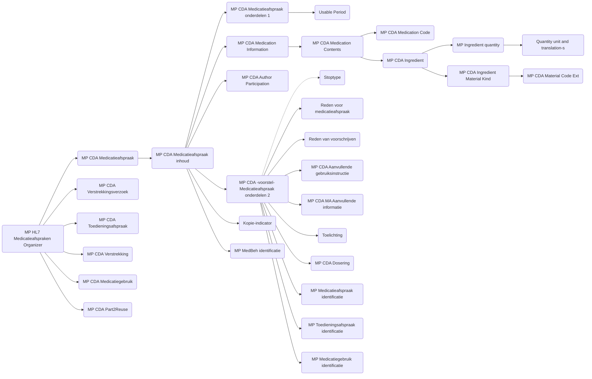

### MP HL7 Medicatieafspraken Organizer – Templates met beschrijving en Nederlandse vertaling

| # | Template-naam | Template-ID (OID) | URL | Beschrijving (EN) | Vertaling (NL) |
|---|----------------|------------------|-----|-------------------|----------------|
| 1 | **MP HL7 Medicatieafspraken Organizer** | 2.16.840.1.113883.2.4.3.11.60.20.77.10.9265 | [Link](https://decor.nictiz.nl/pub/medicatieproces/mp-html-20181220T121121/tmp-2.16.840.1.113883.2.4.3.11.60.20.77.10.9265-2018-12-13T000000.html) | Organizer representing all related medication agreements of a patient. | Organizer die alle gerelateerde medicatieafspraken van een patiënt groepeert. |
| 2 | **MP CDA Medicatieafspraak** | 2.16.840.1.113883.2.4.3.11.60.20.77.10.9235 | [Link](https://decor.nictiz.nl/pub/medicatieproces/mp-html-20181220T121121/tmp-2.16.840.1.113883.2.4.3.11.60.20.77.10.9235-2018-12-04T143321.html) | CDA entry representing a single medication agreement. | CDA-invoer die een enkele medicatieafspraak beschrijft. |
| 3 | **MP CDA Medicatieafspraak inhoud** | 2.16.840.1.113883.2.4.3.11.60.20.77.10.9233 | [Link](https://decor.nictiz.nl/pub/medicatieproces/mp-html-20181220T121121/tmp-2.16.840.1.113883.2.4.3.11.60.20.77.10.9233-2018-12-04T130547.html) | Defines the content of a medication agreement. | Definieert de inhoud van een medicatieafspraak. |
| 4 | **MP CDA Medicatieafspraak onderdelen-1** | 2.16.840.1.113883.2.4.3.11.60.20.77.10.9184 | [Link](https://decor.nictiz.nl/pub/medicatieproces/mp-html-20181220T121121/tmp-2.16.840.1.113883.2.4.3.11.60.20.77.10.9184-2017-08-18T092503.html) | First part of medication agreement details. | Eerste deel van de onderdelen van een medicatieafspraak. |
| 5 | **Usable Period** | 2.16.840.1.113883.2.4.3.11.60.20.77.10.9019 | [Link](https://decor.nictiz.nl/pub/medicatieproces/mp-html-20181220T121121/tmp-2.16.840.1.113883.2.4.3.11.60.20.77.10.9019-2016-07-01T155004.html) | Time interval for which a medication agreement is valid. | Tijdsperiode waarin een medicatieafspraak geldig is. |
| 6 | **MP CDA Medication Information** | 2.16.840.1.113883.2.4.3.11.60.20.77.10.9254 | [Link](https://decor.nictiz.nl/pub/medicatieproces/mp-html-20181220T121121/tmp-2.16.840.1.113883.2.4.3.11.60.20.77.10.9254-2018-12-06T143451.html) | Provides product information for the medication. | Bevat productinformatie over het geneesmiddel. |
| 7 | **MP CDA Medication Contents** | 2.16.840.1.113883.2.4.3.11.60.20.77.10.9264 | [Link](https://decor.nictiz.nl/pub/medicatieproces/mp-html-20181220T121121/tmp-2.16.840.1.113883.2.4.3.11.60.20.77.10.9264-2018-12-11T154905.html) | Describes the composition and content of the medication. | Beschrijft de samenstelling en inhoud van het geneesmiddel. |
| 8 | **MP CDA Medication Code** | 2.16.840.1.113883.2.4.3.11.60.20.77.10.9253 | [Link](https://decor.nictiz.nl/pub/medicatieproces/mp-html-20181220T121121/tmp-2.16.840.1.113883.2.4.3.11.60.20.77.10.9253-2018-12-06T133041.html) | Provides the coded identifier for the medication. | Bevat de gecodeerde identificatie van het geneesmiddel. |
| 9 | **MP CDA Ingredient** | — | — | Defines the ingredient(s) of the medication. | Definieert de bestanddelen van het geneesmiddel. |
| 10 | **MP Ingredient quantity** | — | — | Specifies the quantity of the ingredient. | Geeft de hoeveelheid van een bestanddeel aan. |
| 11 | **MP CDA Ingredient Material Kind** | — | — | Defines the type of ingredient material. | Beschrijft het type grondstof van het bestanddeel. |
| 12 | **MP CDA Material Code Ext** | — | — | Coded representation of the ingredient material. | Gecodeerde representatie van de grondstof van het bestanddeel. |
| 13 | **Quantity unit and translation-s** | — | — | Defines unit of measurement and translations. | Definieert eenheid van maat en vertalingen. |
| 14 | **MP CDA Author Participation** | 2.16.840.1.113883.2.4.3.11.60.20.77.10.9066 | [Link](https://decor.nictiz.nl/pub/medicatieproces/mp-html-20181220T121121/tmp-2.16.840.1.113883.2.4.3.11.60.20.77.10.9066-2018-12-05T174210.html) | Describes the author of the medication agreement. | Beschrijft de auteur van de medicatieafspraak. |
| 15 | **Kopie-indicator** | 2.16.840.1.113883.2.4.3.11.60.20.77.10.9200 | [Link](https://decor.nictiz.nl/pub/medicatieproces/mp-html-20181220T121121/tmp-2.16.840.1.113883.2.4.3.11.60.20.77.10.9200-2018-01-12T101847.html) | Indicates whether the entry is a copy. | Geeft aan of de invoer een kopie betreft. |
| 16 | **MP MedBeh identificatie** | 2.16.840.1.113883.2.4.3.11.60.20.77.10.9084 | [Link](https://decor.nictiz.nl/pub/medicatieproces/mp-html-20181220T121121/tmp-2.16.840.1.113883.2.4.3.11.60.20.77.10.9084-2016-06-21T103838.html) | Identification of medical behavior (unique ID). | Identificatie van de medische handeling (unieke ID). |
| 17 | **MP CDA Medicatieafspraak onderdelen-2 (voorstel)** | 2.16.840.1.113883.2.4.3.11.60.20.77.10.9234 | [Link](https://decor.nictiz.nl/pub/medicatieproces/mp-html-20181220T121121/tmp-2.16.840.1.113883.2.4.3.11.60.20.77.10.9234-2018-12-04T140853.html) | Proposed set of elements for medication agreement. | Voorgestelde set onderdelen voor medicatieafspraak. |
| 18 | **Stoptype** | 2.16.840.1.113883.2.4.3.11.60.20.77.10.9067 | [Link](https://decor.nictiz.nl/pub/medicatieproces/mp-html-20181220T121121/tmp-2.16.840.1.113883.2.4.3.11.60.20.77.10.9067-2016-06-17T102209.html) | Defines the reason or type for stopping medication. | Beschrijft de reden of het type voor het stoppen van medicatie. |
| 19 | **Reden voor medicatieafspraak** | 2.16.840.1.113883.2.4.3.11.60.20.77.10.9270 | [Link](https://decor.nictiz.nl/pub/medicatieproces/mp-html-20181220T121121/tmp-2.16.840.1.113883.2.4.3.11.60.20.77.10.9270-2018-12-18T111500.html) | Reason for the medication agreement. | Reden van de medicatieafspraak. |
| 20 | **Reden van voorschrijven** | 2.16.840.1.113883.2.4.3.11.60.20.77.10.9160 | [Link](https://decor.nictiz.nl/pub/medicatieproces/mp-html-20181220T121121/tmp-2.16.840.1.113883.2.4.3.11.60.20.77.10.9160-2016-11-09T134526.html) | Reason for prescribing a medication. | Reden voor het voorschrijven van medicatie. |
| 21 | **MP CDA Aanvullende gebruiksinstructie** | 2.16.840.1.113883.2.4.3.11.60.20.77.10.9085 | [Link](https://decor.nictiz.nl/pub/medicatieproces/mp-html-20181220T121121/tmp-2.16.840.1.113883.2.4.3.11.60.20.77.10.9085-2016-06-21T114818.html) | Additional usage instruction for medication. | Aanvullende gebruiksinstructie voor medicatie. |
| 22 | **MP CDA MA Aanvullende informatie** | 2.16.840.1.113883.2.4.3.11.60.20.77.10.9177 | [Link](https://decor.nictiz.nl/pub/medicatieproces/mp-html-20181220T121121/tmp-2.16.840.1.113883.2.4.3.11.60.20.77.10.9177-2017-05-23T084315.html) | Additional information related to medication agreement. | Aanvullende informatie met betrekking tot de medicatieafspraak. |
| 23 | **Toelichting** | 2.16.840.1.113883.2.4.3.11.60.20.77.10.9069 | [Link](https://decor.nictiz.nl/pub/medicatieproces/mp-html-20181220T121121/tmp-2.16.840.1.113883.2.4.3.11.60.20.77.10.9069-2016-06-17T163405.html) | Provides explanatory text or notes. | Biedt toelichtende tekst of opmerkingen. |
| 24 | **MP CDA Dosering** | 2.16.840.1.113883.2.4.3.11.60.20.77.10.9149 | [Link](https://decor.nictiz.nl/pub/medicatieproces/mp-html-20181220T121121/tmp-2.16.840.1.113883.2.4.3.11.60.20.77.10.9149-2016-07-25T134340.html) | Defines the dosage information. | Definieert de doseringsinformatie. |
| 25 | **MP Medicatieafspraak identificatie** | 2.16.840.1.113883.2.4.3.11.60.20.77.10.9086 | [Link](https://decor.nictiz.nl/pub/medicatieproces/mp-html-20181220T121121/tmp-2.16.840.1.113883.2.4.3.11.60.20.77.10.9086-2016-06-21T122009.html) | Identifier for the medication agreement. | Identificatie van de medicatieafspraak. |
| 26 | **MP Toedieningsafspraak identificatie** | 2.16.840.1.113883.2.4.3.11.60.20.77.10.9101 | [Link](https://decor.nictiz.nl/pub/medicatieproces/mp-html-20181220T121121/tmp-2.16.840.1.113883.2.4.3.11.60.20.77.10.9101-2016-06-24T130316.html) | Identifier for the administration agreement. | Identificatie van de toedieningsafspraak. |
| 27 | **MP Medicatiegebruik identificatie** | 2.16.840.1.113883.2.4.3.11.60.20.77.10.9176 | [Link](https://decor.nictiz.nl/pub/medicatieproces/mp-html-20181220T121121/tmp-2.16.840.1.113883.2.4.3.11.60.20.77.10.9176-2017-05-22T183626.html) | Identifier for medication use. | Identificatie van medicatiegebruik. |
