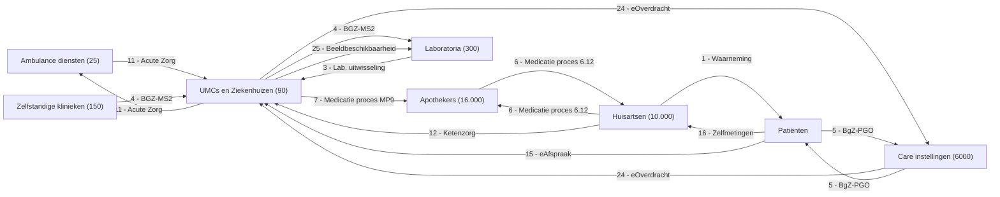

```mermaid
graph LR

    %% Nodes
    AmbulanceDiensten["Ambulance diensten (25)"]
    Apotheken["Apothekers (16.000)"]
    Huisartsen["Huisartsen (10.000)"]
    Patiënten["Patiënten"]
    CareInstellingen["Care instellingen (6000)"]
    ZKlinieken["Zelfstandige klinieken (150)"]
    Laboratoria["Laboratoria (300)"]
    UMCZiekenhuizen["UMCs en Ziekenhuizen (90)"]

    %% Connections (labels only, colors can be added if you'd like)
    AmbulanceDiensten -->|11 - Acute Zorg| UMCZiekenhuizen
    UMCZiekenhuizen -->|11 - Acute Zorg| AmbulanceDiensten

    Apotheken -->|6 - Medicatie proces 6.12| Huisartsen
    Huisartsen -->|6 - Medicatie proces 6.12| Apotheken

    Huisartsen -->|1 - Waarneming| Patiënten
    Patiënten -->|16 - Zelfmetingen| Huisartsen

    Huisartsen -->|12 - Ketenzorg| UMCZiekenhuizen

    UMCZiekenhuizen -->|7 - Medicatie proces MP9| Apotheken
    UMCZiekenhuizen -->|4 - BGZ-MS2| Laboratoria
    UMCZiekenhuizen -->|25 - Beeldbeschikbaarheid| Laboratoria
    Laboratoria -->|3 - Lab. uitwisseling| UMCZiekenhuizen

    UMCZiekenhuizen -->|24 - eOverdracht| CareInstellingen
    CareInstellingen -->|24 - eOverdracht| UMCZiekenhuizen

    Patiënten -->|5 - BgZ-PGO| CareInstellingen
    CareInstellingen -->|5 - BgZ-PGO| Patiënten

    Patiënten -->|15 - eAfspraak| UMCZiekenhuizen

    ZKlinieken -->|4 - BGZ-MS2| UMCZiekenhuizen

```
